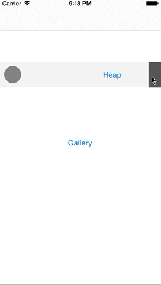

# HeapInspector
## Find memory issues & leaks in your iOS app
[](https://travis-ci.org/tapwork/HeapInspector-for-iOS)
[](https://github.com/tapwork/HeapInspector-for-iOS/blob/master/HeapInspector.podspec)
[](https://github.com/tapwork/HeapInspector-for-iOS/blob/master/LICENSE.md)
[]()
[](https://github.com/Carthage/Carthage)
[](http://twitter.com/cmenschel)

HeapInspector is a debug tool that **monitors the memory heap** with backtrace recording in your iOS app. You can discover memory leaks, no longer used objects, abandoned memory and more issues directly on your device without ever starting Instruments.

#### Memory heap snapshots with backtrace record
Basically you can inspect the entire heap and see all living objects of your iOS app. <br>
To be more precise you can record the heap for a specific part of the app. For instance when navigating through the menu. Like in Apple's Instruments the snapshot compares the heap before you started recording. For instance you can start the snapshot before you push a new `UIViewController` onto your `UINavigationController` stack and stop after popping the `UIViewController`.
With HeapInspector and heap snapshots you can identify:
* Leaking objects
* Retain cycles
* Living objects that are no longer needed
* static objects like singletons or cached `UIImage`
* Dirty memory and your objects on the heap

HeapInspector gives you detailed information for the living objects:

* Reference history (backtrace support) See who called retain, strong, release
* Responder chain for recorded objects
* Screenshots of the inspected UIView, UIViewController, UIImage
* Detailed information about the object (Description, frame, properties, iVars, methods)

# In Action




# Why
Since ARC has been introduced we don't need to manage the `retain` & `release` anymore. ARC is very powerful and makes Objective-C more stable. ARC decreased the number of crashes and improves the memory footprint.<br> ARC is technically doing a powerful job. It knows when to `retain`, `autorelease` and `release`.
<br>But ARC doesn't think about the overall architecture how to design for low memory usage. You should be aware that you can still do a lot of things wrong with your memory (even with ARC). You can still get memory pressures or peaks with ARC.
* You can still create Retain Cycles
* The `strong` property lifetime qualifier can be misused (i.e. holding an object twice and longer than needed.)
* Memory peaks through loops (if you're not using a proper `@autoreleasepool`)
* Wrong caching with `static`

And that's why we introduced HeapInspector to find those issues.

# Installation
### CocoaPods
HeapInspector runs with Objective-C and Swift via CocoaPods
Just add the HeapInspector to your `Podfile`.
```
pod "HeapInspector"
```
and run `pod install` afterwards.

### Carthage 
You can use [Carthage](https://github.com/Carthage/Carthage). 
Specify in Cartfile:

```ruby
github "tapwork/HeapInspector-for-iOS"
```

### Manual 
Download the repository into your project via git or just as zip.
Drag it the `HeapInspector` folder into your Xcode project. See following image.

Disable ARC for `NSObject+HeapInspector.m` by adding `-fno-objc-arc` to Xcode's Build Phases -> Compile Source. See example images here: [Drag](README_Xtras/drag.png) and [disable ARC](README_Xtras/no_arc.png)

# How to use it

Make sure to import the header file<br />
**Objective-C**
```objc
@import HeapInspector;
```
**Swift**
```swift
import HeapInspector
```

### Start
Just run the following to start HeapInspector in a separated debug window. The window can be moved on your screen in order to reach all your UI elements. The left circle button starts / stops the memory heap snapshot. See demo above.<br />
**Objective-C**
```objc
[HINSPDebug start];
```
**Swift**
```swift
HINSPDebug.start()
```

We recommend to use a specific class prefixes, Swift modules or even a real classes like `UIImageView`.
Or just run `start` to record all NSObject subclasses.<br />
**Objective-C**
```objc
[HINSPDebug addClassPrefixesToRecord:@[@"RM", @"UITableView"];
```
**Swift**
You can register modules for the heap snapshot and recordings.
```swift
HINSPDebug.addSwiftModulesToRecord(["MyModule", "AnotherFrameworkModule"])
```
### Stop
Stopping and removing the inspector's window goes with<br />
**Objective-C**
```objc
[HINSPDebug stop];
```
**Swift**
```swift
HINSPDebug.stop()
```
Just call the start/stop methods at app launch or via your custom button.

### Backtrace record
HeapInspector can also record the backtrace for each object that received an alloc, retain, release or dealloc.
Use this only with very specific recorded classes or in smaller apps.
Start the backtrace with<br />
**Objective-C**
```objc
[HINSPDebug recordBacktraces:YES]; 
```
**Swift**
```swift
HINSPDebug.recordBacktraces(true)
```

# Example project
HeapInspector comes with an example project. There you will see a lot of mistakes made with the memory design.  
* `strong` delegate properties
* `NSTimer` that is not being invalidated properly
*  Holding objects longer than needed. `strong` property for the `UIViewController` that is pushed onto the `UINavigationController` stack

# References, Inspirations & Thanks
* [FLEX](https://github.com/flipboard/flex) by [Ryan Olson](https://twitter.com/ryanolsonk)
* [Mike Ash](https://www.mikeash.com/pyblog/friday-qa-2011-09-30-automatic-reference-counting.html) Friday Q&A Automatic Reference Counting
* [Clang](http://clang.llvm.org/docs/AutomaticReferenceCounting.html) Objective-C Automatic Reference Counting (ARC)

# Author
* [Christian Menschel](http://github.com/tapwork) ([@cmenschel](https://twitter.com/cmenschel))  ([@xing](https://twitter.com/xingdevs))

# License
[MIT](LICENSE.md)
